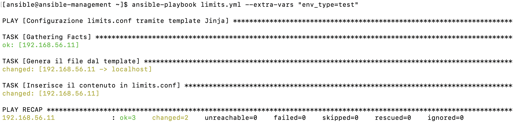
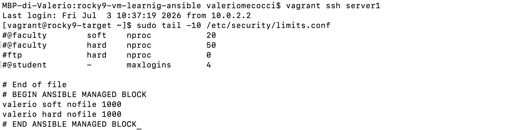
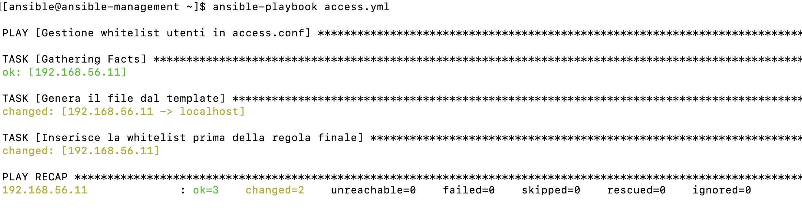
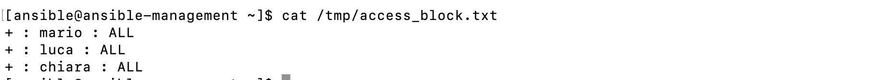

# 1. Configurazione dinamica di `/etc/security/limits.conf` 

## Descrizione dell'esercizio

L'obiettivo dell'esercizio è creare un playbook Ansible in grado di configurare automaticamente il file `/etc/security/limits.conf` utilizzando un template Jinja.

In particolare, il numero massimo di file aperti (`nofile`) deve assumere valori differenti in base all'ambiente di esecuzione:

* Produzione (`prod`) --> `10000`
* Collaudo (`test`) --> `1000`
* Sviluppo (`dev`) --> `1000`

Per evitare di mantenere più file di configurazione, viene utilizzato un unico template che genera dinamicamente il contenuto corretto.

---

### Cosa sono i template

Un template è un file di testo che contiene sia contenuto fisso sia parti dinamiche rappresentate da variabili o istruzioni. Durante l'esecuzione del playbook, Ansible sostituisce le variabili con i valori effettivi e genera automaticamente il file finale.

L'utilizzo dei template evita di creare più versioni dello stesso file di configurazione per ambienti diversi 
(come in questo caso: sviluppo, collaudo, produzione), consentendo di mantenere un unico modello dal quale
 ottenere configurazioni differenti.

---

### Cos'è Jinja

Jinja (o Jinja2) è un motore di template sviluppato per Python e utilizzato da Ansible per la generazione dinamica dei file.

All'interno di un template Jinja è possibile utilizzare:

* **Variabili**, per inserire valori dinamici.
* **Espressioni**, per elaborare dati.
* **Strutture condizionali**, come `if`, `elif` ed `else`, per generare contenuti differenti in base a determinate condizioni.
* **Cicli**, come `for`, per ripetere automaticamente blocchi di testo.

I template Jinja vengono normalmente salvati con estensione `.j2`.

---

### Integrazione tra Jinja e Ansible

Ansible utilizza il modulo `ansible.builtin.template` per elaborare un template Jinja.

Durante l'esecuzione del playbook, il modulo legge il file `.j2`, sostituisce le variabili con i valori disponibili nel playbook (o passati tramite `--extra-vars`) e genera un nuovo file contenente il risultato finale.

Il file generato può poi essere copiato su un host remoto oppure utilizzato da altri moduli Ansible, come `blockinfile`, `copy` o `lineinfile`.

--- 

## Template Jinja

Si crea un template `limits.j2` contenente sia testo fisso sia istruzioni Jinja.


```jinja

{{ username }} soft nofile 10000
{{ username }} hard nofile 10000


{{ username }} soft nofile 1000
{{ username }} hard nofile 1000


```

All'interno del template troviamo:

* *Variabili* , racchiuse tra `{{ }}`, che vengono sostituite con il loro valore durante l'esecuzione del playbook.
* *La struttura condizionale* ``, `` e ``, che permette di generare contenuti 
diversi in base al valore della variabile `env_type`.

Le righe all'inerno della struttura condizionale sono del tipo `<utente> <tipo_limite> <risorsa> <valore>`
in cui
- `<utente>`: utente a cui applicare la regola;
- `<tipo_limite>`: può essere 
    - `soft`: per indicare il limite effettivo, l'utente può modificarlo fino ad un valore `hard`
    - `hard`: per indicare il limite massimo a cui può essere impostato `soft`. Solo l'utente `root` 
      può modificare questo limite;
- `<risorsa>`: in questo caso è `nofile` numero di file aperti;
- `<valore>`: indica il valore del limite.


---

## Playbook `limits.yml`


```yaml
---
- name: Configurazione limits.conf tramite template Jinja
  hosts: targets
  become: true

  vars:
    username: valerio
    env_type: prod

  tasks:

    - name: Genera il file dal template
      ansible.builtin.template:
        src: limits.j2
        dest: /tmp/limits_output.txt
      delegate_to: localhost

    - name: Inserisce il contenuto in limits.conf
      ansible.builtin.blockinfile:
        path: /etc/security/limits.conf
        block: "{{ lookup('ansible.builtin.file', '/tmp/limits_output.txt') }}"
        insertafter: EOF
        create: yes

```
----

All'interno del playbook:

* la variabile `username` identifica l'utente al quale applicare i limiti;
* la variabile `env_type` identifica invece l'ambiente di esecuzione e determina quale blocco del template verrà generato,

---

### Utilizzo del modulo `template`

  Il primo task del playbook utilizza il modulo:

```yaml
ansible.builtin.template
```

Questo modulo ha il compito di elaborare un template Jinja e produrre un file di testo contenente il risultato finale.


I parametri utilizzati sono:

* **src**: indica il percorso del template Jinja da elaborare.
* **dest**: indica il file che verrà creato dopo aver sostituito tutte le variabili 
e valutato le condizioni presenti nel template.


La direttiva `delegate_to` permette di eseguire un determinato task su un host diverso da quello indicato nella
direttiva `hosts` del playbook.

Nel nostro caso tutti i task vengono eseguiti nel sulle macchine apparteneti al gruppo `targets`. In questo caso, invece,
con

```yaml
delegate_to: localhost
```

il task viene eseguito sul controller Ansible (`localhost` perché si riferisce alla macchina su cui viene eseguito il playbook)
 anziché sulle macchine che Ansible gestisce.

Questo è necessario per il task successivo, in cui si utilizza la funzione `lookup` che legge _sempre_ i file
sul controller Ansible, quindi leggerà il file temporaneo `/tmp/limits_output.txt` che conterrà il blocco 
completo già pronto per essere inserito in `limits.conf`.


---

### Utilizzo del modulo `blockinfile`

Una volta generato il file temporaneo, è stato utilizzato il modulo:

```yaml
ansible.builtin.blockinfile
```

Questo modulo permette di inserire, aggiornare o rimuovere un intero blocco di testo all'interno di un file esistente.

Nel nostro caso il task è il seguente:

```yaml
- name: Inserisce il contenuto in limits.conf
  ansible.builtin.blockinfile:
    path: /etc/security/limits.conf
    block: "{{ lookup('ansible.builtin.file', '/tmp/limits_output.txt') }}"
    insertafter: EOF
    create: yes
```

I parametri utilizzati sono:

* **path**: file che dovrà essere modificato.
* **block**: contenuto da inserire nel file.
* **insertafter: EOF**: aggiunge il blocco alla fine del file.
* **create: yes**: crea il file se non esiste.


Per il blocco da inserire viene utilizzata la funzione:

```yaml
lookup('ansible.builtin.file', '/tmp/limits_output.txt')
```

La funzione `lookup` permette ad Ansible di leggere informazioni provenienti da sorgenti esterne.

In questo caso viene utilizzato il plugin `ansible.builtin.file`, che legge il contenuto del 
file generato dal modulo `template`.

Il testo letto viene restituito come *stringa* e inserito automaticamente nel parametro 
`block` del modulo `blockinfile`.

In questo modo non è necessario copiare manualmente il contenuto del file temporaneo.

---

## Esecuzione del playbook

Il playbook viene eseguito con il comando:

```bash
ansible-playbook limits.yml
```

È inoltre possibile cambiare ambiente senza modificare il playbook utilizzando l'opzione:

```bash
ansible-playbook limits.yml --extra-vars "env_type=test"
```

oppure

```bash
ansible-playbook limits.yml --extra-vars "env_type=dev"
```

In questo caso la variabile `env_type` viene passata direttamente dalla riga di comando e il template produrrà automaticamente la configurazione corretta.

---

## Output



---
Il file temporaneo sul control node


---

Le ultime 10 righe del file `/etc/security/limits.conf` sulla macchina gestita da Ansible





<br><br>


# 2. Gestione della whitelist di utenti

## Descrizione dell'esercizio

L'obiettivo di questo esercizio è creare un playbook Ansible che aggiunga automaticamente una lista di 
utenti autorizzati (_whitelist_) all'interno del file `/etc/security/access.conf`.

La whitelist deve essere inserita *prima* della regola:

```text
- : ALL : ALL
```

che nega l'accesso a tutti gli utenti non autorizzati esplicitamente.

Per ottenere questo risultato vengono utilizzati:

- un **template Jinja**, che genera dinamicamente il blocco contenente gli utenti della whitelist;
- il modulo **ansible.builtin.template**, che genera il file finale a partire dal template;
- il modulo **ansible.builtin.blockinfile**, che inserisce il blocco nel punto corretto del file;
- il parametro **insertbefore** del modulo ansible.builtin.blockinfile, che consente di inserire la
 whitelist prima della regola che 
nega l'accesso a tutti gli altri utenti.
- la funzione **lookup**, che legge il contenuto del file generato dal template.


---

## Il file `/etc/security/access.conf`

Il file `/etc/security/access.conf` viene utilizzato dal modulo PAM (`pam_access`) per controllare 
quali utenti possono effettuare l'accesso al sistema.

Le regole vengono elaborate dall'alto verso il basso.

La sintassi utilizzata è `permission : users : origins`

* _permission_: indica se consentire (+) o negare (-) l'accesso;
* _users_: indica gli utenti o i gruppi a cui si applica la regola;
* _origins_: indica da dove è consentito o negato l'accesso;


Ad esempio:

```text
+ : root : ALL
```

consente l'accesso all'utente `root` indipendentemente dalla provenienza della 
connessione (console locale, SSH, rete, ecc.) e questo è dato da `ALL`.

La regola:

```text
- : ALL : ALL
```

nega invece l'accesso a tutti gli utenti che non sono stati autorizzati nelle righe precedenti.

Per questo motivo la whitelist deve essere inserita *prima* di questa regola. 
Se venisse inserita dopo, non avrebbe alcun effetto, poiché l'accesso sarebbe già stato negato.

---

## Template Jinja

Si crea il file `access.j2`.

Il template contiene un ciclo `for` di Jinja che genera automaticamente una riga per ogni utente presente nella whitelist.

```jinja

+ : {{ user }} : ALL

```


All'interno del template vengono utilizzati due elementi di Jinja.

1. Ciclo `for`

    ```jinja
    
    ```

    Il ciclo scorre tutti gli elementi presenti nella lista `whitelist`.

    Ad ogni iterazione la variabile `user` assume il valore di un utente differente.

2. Variabile

    ```jinja
    {{ user }}
    ```

    Le variabili racchiuse tra `{{ }}` vengono sostituite con il loro valore durante l'elaborazione del template.

 ---

## Playbook `access.yml`


```yaml
---
- name: Gestione whitelist utenti in access.conf
  hosts: targets
  become: true

  vars:
    whitelist:
      - mario
      - luca
      - chiara

  tasks:

    - name: Genera il file dal template
      ansible.builtin.template:
        src: access.j2
        dest: /tmp/access_block.txt
      delegate_to: localhost

    - name: Inserisce la whitelist prima della regola finale
      ansible.builtin.blockinfile:
        path: /etc/security/access.conf
        block: "{{ lookup('ansible.builtin.file', '/tmp/access_block.txt') }}"
        insertbefore: "^- : ALL : ALL"
        marker: "# {mark} ANSIBLE WHITELIST"
```

---


La variabile `whitelist` è una lista contenente gli utenti che dovranno essere autorizzati.Il template utilizzerà 
automaticamente questa lista per generare il blocco da inserire nel file di configurazione.

---

### Modulo `ansible.builtin.blockinfile`

#### Parametro `insertbefore`


```yaml
insertbefore: "^- : ALL : ALL"
```

Questo parametro indica ad Ansible di inserire il blocco *prima* della riga che corrisponde all'espressione specificata.

Nel nostro caso viene cercata la riga:

```text
- : ALL : ALL
```

Il simbolo `^` indica l'inizio della riga ed evita corrispondenze accidentali.

Grazie a questo parametro la whitelist viene inserita immediatamente prima della regola 
finale che nega l'accesso a tutti gli utenti.

---

#### Parametro `marker`

```yaml
marker: "# {mark} ANSIBLE WHITELIST"
```

Il parametro `marker` personalizza i commenti che delimitano il blocco gestito da Ansible.

Il file conterrà quindi:

```text
# BEGIN ANSIBLE WHITELIST

...

# END ANSIBLE WHITELIST
```

Questi marker permettono ad Ansible di riconoscere il blocco durante le esecuzioni successive evitando duplicazioni.

---

## Esecuzione del playbook

Prima di eseguire il playbook è necessario modificare il file `/etc/security/access.conf` sul nodo gestito
da Ansible, rimuovendo il commento alla riga 

```yaml 
# - : ALL : ALL
```

 come richiesto dall'esercizio.

Il playbook viene eseguito con:

```bash
ansible-playbook access.yml
```

Durante l'esecuzione Ansible:

1. legge il template `access.j2`;
2. sostituisce le variabili;
3. genera il file `/tmp/access_block.txt`;
4. legge il contenuto del file tramite `lookup`;
5. inserisce il blocco nel file `/etc/security/access.conf` prima della regola `- : ALL : ALL`.

---

## Output



---

---
Il file temporaneo sul control node




---

Le ultime righe del file `/etc/security/access.conf` sulla macchina gestita da Ansible


