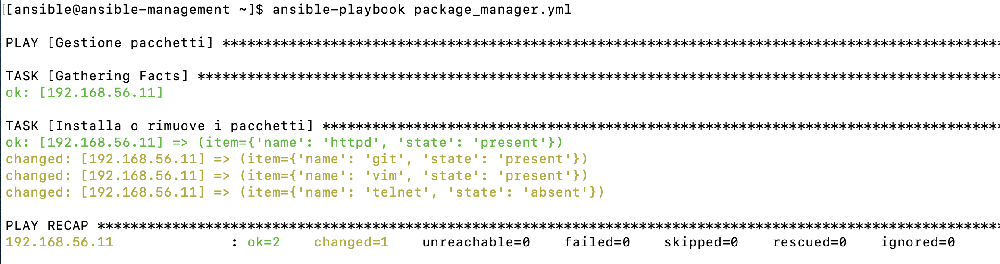
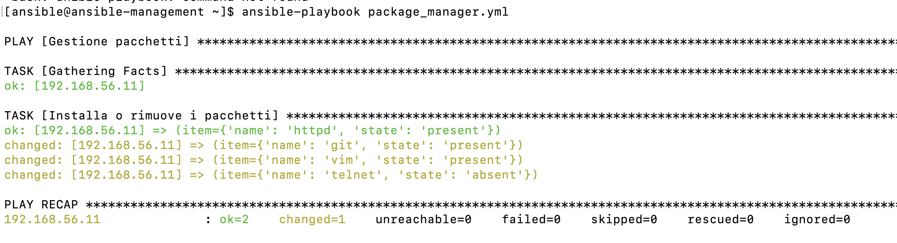
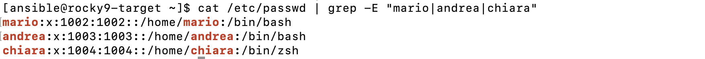

# Esercizi sulle liste e dizionari

## 1. Gestione di una lista di pacchetti 

Creare un playbook Ansible che installi/disinstalli una lista di pacchetti in base a quanto 
definito in un apposito dictionary.


### Playbook _package_manager.yml_

```yaml
---
- name: Gestione pacchetti tramite lista di dizionari
  hosts: targets
  become: true

  vars:
    packages:
      - name: httpd
        state: present

      - name: git
        state: present

      - name: vim
        state: present

      - name: telnet
        state: absent

  tasks:

    - name: Installa o rimuove i pacchetti
      ansible.builtin.dnf:
        name: "{{ item.name }}"
        state: "{{ item.state }}"
      loop: "{{ packages }}"
```


### Struttura del playbook


Il playbook Ansible è suddiviso in diverse sezioni

 ### `---`

Le tre linee (`---`) indicano l'inizio di un documento YAML. È buona pratica inserirle all'inizio di ogni playbook.

---

 ### ` name`

Il campo `name` assegna un nome descrittivo al play. Questo nome viene visualizzato durante l'esecuzione del playbook per identificare il play in esecuzione.

---

### `hosts`

La direttiva `hosts` indica il gruppo di macchine, definito nell'inventory, su cui verranno eseguiti i task del playbook.

---

### `become`

La direttiva `become` abilita l'esecuzione dei task con privilegi amministrativi (root) necessari per 
operazioni come l'installazione o la rimozione dei pacchetti.

---

### `vars`

La sezione `vars` contiene le variabili utilizzate dal playbook. In questo esercizio viene definita la variabile `packages`, 
definita come una lista di quattro elementi, 
ognuno dei quali è un dizionario che specifica il nome dei pacchetti e lo stato desiderato (`present` o `absent`). 


---

### `tasks`

La sezione `tasks` contiene le operazioni che Ansible deve eseguire sugli host indicati. 
In questo playbook è presente un unico task che, tramite `loop`, installa o rimuove tutti i pacchetti definiti nella variabile `packages`.
 
Il modulo ``ansible.builtin.dnf`` permette di gestire i pacchetti nei sistemi Linux basati su dnf 

Nel playbook sono stati utilizzati i seguenti parametri:

- `name` : Specifica il nome del pacchetto da gestire.
- `state`: Definisce lo stato desiderato del pacchetto: il valore `present` installa il pacchetto, mentre `absent`
 lo rimuove.

Con

```yaml
loop: "{{ packages }}"
```
si ripete automaticamente lo stesso task per tutti gli elementi presenti 
nella lista indicata.


Quando Ansible esegue un `loop`, ad ogni iterazione crea automaticamente una variabile temporanea 
chiamata `item`
che rappresenta l'elemento corrente della lista e quindi, in questo caso, un dizionario.

Ad esempio, alla prima iterazione `item` vale:

```yaml
item:
  name: httpd
  state: present
```

`item` scorre la lista automaticamente ad ogni ciclo.

Poiché `item` è un dizionario, è possibile accedere ai suoi campi utilizzando la notazione con il punto, con

```yaml
item.name
```
si richiama il valore associato alla chiave `name` del dizionario corrente.

Stessa cosa per `item.state`.

## Output 



<br><br>


## 2. Gestione di una lista utenti


## Descrizione dell'esercizio

Creare un playbook Ansible che crei una lista di utenti usando le specifiche contenute in una lista 
di dictionary (ad esempio gruppo, home directory, shell, etc…).


### Playbook _package_manager.yml_

```yaml
---
- name: Creazione utenti tramite lista di dizionari
  hosts: targets
  become: true

  vars:
    users:
      - name: mario
        group: dev
        home: /home/mario
        shell: /bin/bash

      - name: andrea
        group: ops
        home: /home/andrea
        shell: /bin/bash

      - name: chiara
        group: admins
        home: /home/chiara
        shell: /bin/zsh

  tasks:
          
    - name: Crea i gruppi
      ansible.builtin.group:
        name: "{{ item.group }}"
        state: present
      loop: "{{ users }}"
             
    - name: Crea gli utenti
      ansible.builtin.user:
        name: "{{ item.name }}"
        group: "{{ item.group }}"
        home: "{{ item.home }}"
        shell: "{{ item.shell }}"
        create_home: true
        state: present
      loop: "{{ users }}"
```


---
### `users`

Nel playbook viene definita la variabile `users` come lista di dizionari con tre elementi: 
ogni dizionario descrive un utente attraverso quattro coppie chiave-valore:

  * `name`: nome dell'utente;
  * `group`: gruppo principale dell'utente;
  * `home`: directory home;
  * `shell`: shell di login.

Questa struttura permette di definire facilmente le caratteristiche di ciascun utente senza dover creare un task dedicato.

---

### `tasks`

Il playbook contiene due task.

1. **Creazione dei gruppi**

Il task utilizza il modulo `ansible.builtin.group` per creare, modificare o rimuovere gruppi di utenti sul sistema.

Nel playbook sono stati utilizzati i seguenti parametri:

- `name` : Specifica il nome del gruppo da creare.
- `state`: Definisce lo stato desiderato del gruppo: il valore `present` assicura che il gruppo esista sul sistema.


Il ciclo `loop` scorre tutti gli elementi della lista e, ad ogni iterazione, `item.group` recupera 
il nome del gruppo da creare.

---

2. **Creazione degli utenti**


Il task utilizza il modulo `ansible.builtin.user` per creare creare, modificare o rimuovere utenti Linux.

- `name` : Nome dell'utente da creare.
- `group`: Gruppo principale a cui assegnare l'utente.
- `home` : Percorso della directory home dell'utente.
- `shell`: Shell di login dell'utente.
- `create_home`:Se impostato a true, crea automaticamente la directory `home` se non esiste.


Anche in questo caso il `loop` scorre la lista `users`. Ad ogni iterazione, `item.name`, `item.group`, `item.home` 
e `item.shell` recuperano i valori del dizionario corrente e li passano al modulo `user` che crea automaticamente 
l'utente con le caratteristiche specificate.

La logica di funzionamento è la stessa dell'esercizio precedente: il ciclo elabora ogni elemento della lista e 
utilizza i valori contenuti nel dizionario per eseguire il task corrispondente.

### Output


 
 ---

Sui nodi gestiti da Ansible, verifichiamo la presenza degli utenti, gruppi, directory home e shell di login.




