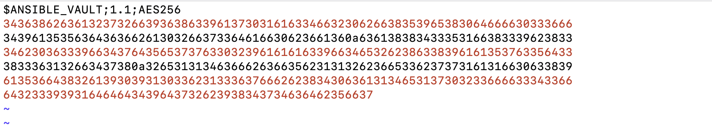
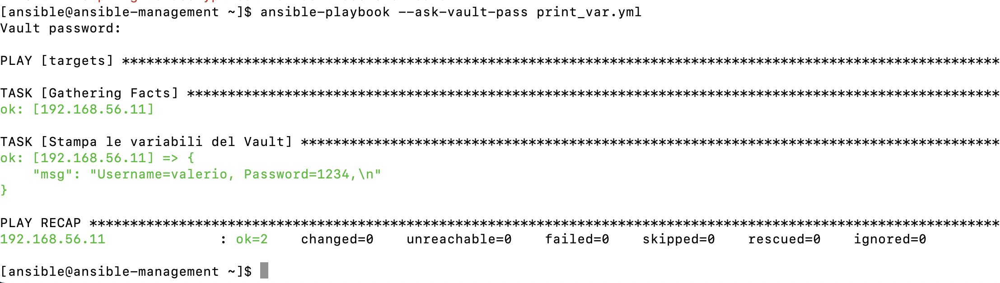

# Esercizio – Utilizzo di Ansible Vault

## Descrizione dell'esercizio

Creare un file Vault contenente alcune variabili nel formato `var_name: value`, includerlo in un playbook tramite la direttiva `vars_files` e stampare a video il valore delle variabili utilizzando Ansible.

## Creazione del file delle variabili

Creiamo il file `vault.yml` contenente le variabili in chiaro:

```yaml
---
username: valerio
password: 1234
```

## Cifratura del file con Ansible Vault

Il file è stato cifrato utilizzando il comando:

```bash
ansible-vault encrypt vault.yml
```

Durante la cifratura Ansible richiede di impostare una password per il Vault

Per questo esercizio è stata utilizzata la password: `0000`

Una volta completata la procedura, il file `vault.yml` non è più leggibile in chiaro ma contiene dati cifrati.



Per visualizzare il contenuto del Vault è possibile utilizzare:

```bash
ansible-vault view --ask-vault-pass vault.yml
```

Inserendo la password del Vault verranno mostrate nuovamente le variabili in chiaro.

## Playbook

Il playbook utilizza la direttiva `vars_files` per importare le variabili contenute nel Vault.

```yaml
---
- hosts: targets

  vars_files:
    - vault.yml

  tasks:

    - name: Stampa le variabili del Vault
      ansible.builtin.debug:
        msg: "Username={{ username }}, Password={{ password }}"
```

## Esecuzione del playbook

Poiché il file delle variabili è cifrato, il playbook deve essere eseguito richiedendo la password del Vault:

```bash
ansible-playbook --ask-vault-pass install-services.yml
```

Ansible mostrerà il prompt:

```text
Vault password:
```

Dopo aver inserito la password corretta, il playbook verrà eseguito e stamperà il valore delle variabili contenute nel Vault.



## Cosa accade senza la password

Se si tenta di eseguire il playbook senza specificare l'opzione:

```bash
--ask-vault-pass
```

Ansible non è in grado di decifrare il file `vault.yml` e interrompe l'esecuzione restituendo un errore, poiché le variabili contenute nel Vault non possono essere lette senza la password corretta.


