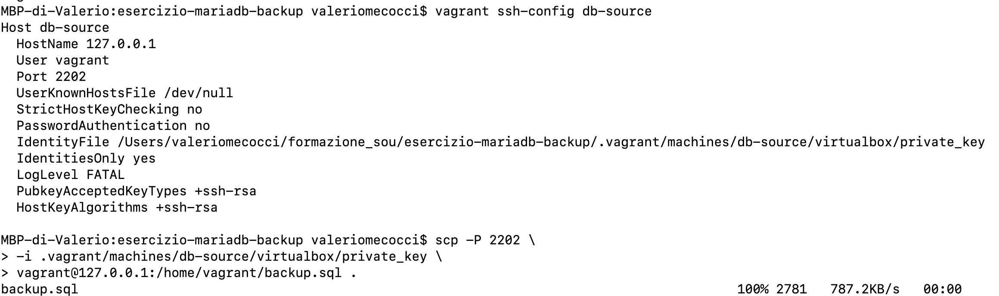
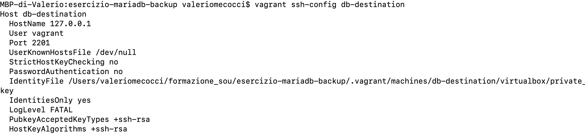
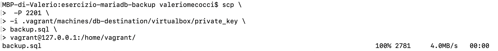
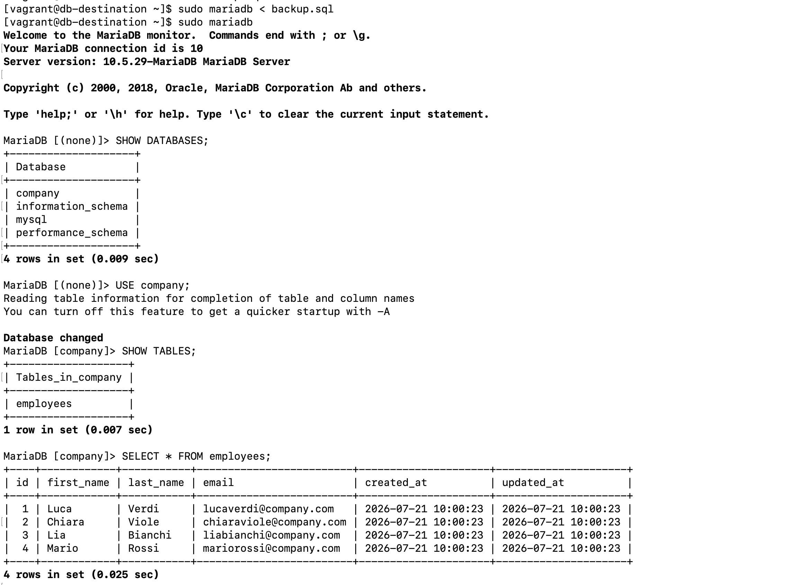

# Backup e Restore di un Database MariaDB tra due VM

## Obiettivo

L'obiettivo dell'esercitazione è stato simulare un classico scenario di amministrazione di database:

1. Creazione di un'istanza MariaDB su una VM e popolarla da con dati di test.
2. Esecuzione del backup del DB.
3. Restore del backup su un'altra istanza dentro un'altra VM.
4. Orchestrare la procedura con Ansible e mettere le credenziali dell'utente DB in un Vault.
5. Studiare lo strumento AWX per eseguire playbook Ansible e integrare quanto fatto in AWX

---

## Orchestrazione manuale (punti 1. 2. 3.)

- Host: macOS
- Hypervisor: VirtualBox
- Provisioning VM: Vagrant
- Sistema operativo VM: Rocky Linux 9
- Database: MariaDB

Sono state create due macchine virtuali:

| VM | Hostname | IP |
|----|----------|----------------|
| VM1 | db-source | 192.168.56.10 |
| VM2 | db-destination | 192.168.56.11 |

La prima VM contiene il database originale, mentre la seconda viene utilizzata per simulare un nuovo server sul quale ripristinare il backup.

---

### Installazione istanza MariaDB su una VM e popolarla da con dati di test

Su entrambe le macchine virtuali è stato installato MariaDB Server utilizzando il package manager `dnf`.

Aggiornamento della cache dei repository:

```bash
sudo dnf makecache
```

Installazione di MariaDB:

```bash
sudo dnf install -y mariadb-server
```

Abilitazione del servizio all'avvio ed avvio immediato:

```bash
sudo systemctl enable --now mariadb
```

Verifica dello stato del servizio:

```bash
systemctl status mariadb
```


---

### Creazione del database

Accesso al client MariaDB:

```bash
sudo mariadb
```

Creazione del database:

```sql
CREATE DATABASE company;
```

Selezione del database:

```sql
USE company;
```

---

### Creazione della tabella

È stata creata la tabella `employees`, che rappresenta un semplice archivio dipendenti.

```sql
CREATE TABLE employees (
    id INT AUTO_INCREMENT PRIMARY KEY,
    first_name VARCHAR(50) NOT NULL,
    last_name VARCHAR(50) NOT NULL,
    email VARCHAR(100) NOT NULL UNIQUE,
    created_at TIMESTAMP DEFAULT CURRENT_TIMESTAMP,
    updated_at TIMESTAMP DEFAULT CURRENT_TIMESTAMP
        ON UPDATE CURRENT_TIMESTAMP
);
```

### Struttura della tabella

Verifica tramite:

```sql
DESCRIBE employees;
```

Output:

| Campo | Tipo | Descrizione |
|--------|------|-------------|
| id | int(11) | Identificativo univoco del dipendente |
| first_name | varchar(50) | Nome |
| last_name | varchar(50) | Cognome |
| email | varchar(100) | Email univoca |
| created_at | timestamp | Data di creazione del record |
| updated_at | timestamp | Ultima modifica del record |

---

### Inserimento dei dati di test

Sono stati inseriti alcuni record nella tabella utilizzando il comando:

```sql
INSERT INTO employees
(first_name,last_name,email)
VALUES
(...),
(...),
(...);
```

Per verificare il contenuto della tabella:

```sql
SELECT * FROM employees;
```

---

### Backup del database

Per creare un backup logico è stato utilizzato il comando `mysqldump`.


```bash
sudo mysqldump --databases company > backup.sql
```

Questa opzione include nel file anche le istruzioni:

```sql
CREATE DATABASE company;

USE company;
```

Il file risultante è quindi completamente autonomo e può essere ripristinato su un'altra 
istanza MariaDB senza creare preventivamente il database.

---

### Copia del file di backup

Per conoscere i parametri di connessione SSH di una macchina virtuale è stato utilizzato il comando:

```bash
vagrant ssh-config db-destination
```

Questo comando non apre una connessione SSH, ma visualizza la configurazione necessaria per collegarsi alla VM, tra cui:

- utente (`User`);
- indirizzo (`HostName`);
- porta SSH (`Port`);
- percorso della chiave privata (`IdentityFile`).

Queste informazioni sono utilizzate da strumenti come `ssh` e `scp` per stabilire 
automaticamente una connessione con la macchina virtuale senza dover configurare manualmente tutti i parametri.

<br>

Il file `backup.sql` è stato copiato dalla VM `db-source` al Mac tramite `scp`.



- `scp`: programma che copia file tramite SSH.
- `-P 2202`: specifica la porta SSH della VM `db-source`.
- `-i .vagrant/machines/db-source/virtualbox/private_key`: utilizza la chiave privata generata automaticamente
 da Vagrant per autenticarsi senza password.
- `vagrant@127.0.0.1:/home/vagrant/backup.sql`: indica il file remoto da copiare (`backup.sql`) 
presente nella home dell'utente `vagrant` sulla VM.
- `.`: rappresenta la directory corrente del Mac, cioè la destinazione in cui verrà salvato il file.


<br>

Successivamente è stato copiato dal Mac alla VM `db-destination`, sempre tramite `scp`.






- `-P 2201`: utilizza la porta SSH della VM `db-destination`.
- `-i .vagrant/machines/db-destination/virtualbox/private_key`: usa la chiave privata della seconda macchina virtuale.
- `backup.sql` → file locale presente sul Mac.
- `vagrant@127.0.0.1:/home/vagrant/` → directory di destinazione sulla VM `db-destination`.

---


### Restore del database

Sulla VM `db-destination` è stato eseguito il restore mediante:

```bash
sudo mariadb < backup.sql
```

MariaDB ha eseguito automaticamente tutte le istruzioni contenute nel dump:

- creazione del database;
- selezione del database;
- creazione della tabella;
- inserimento dei record.

---

### Verifica del restore

Dopo il ripristino sono state eseguite alcune query di verifica.



I risultati ottenuti sulla seconda macchina virtuale coincidono con quelli presenti sulla VM originale, confermando che il backup e il restore sono stati eseguiti correttamente.

---

