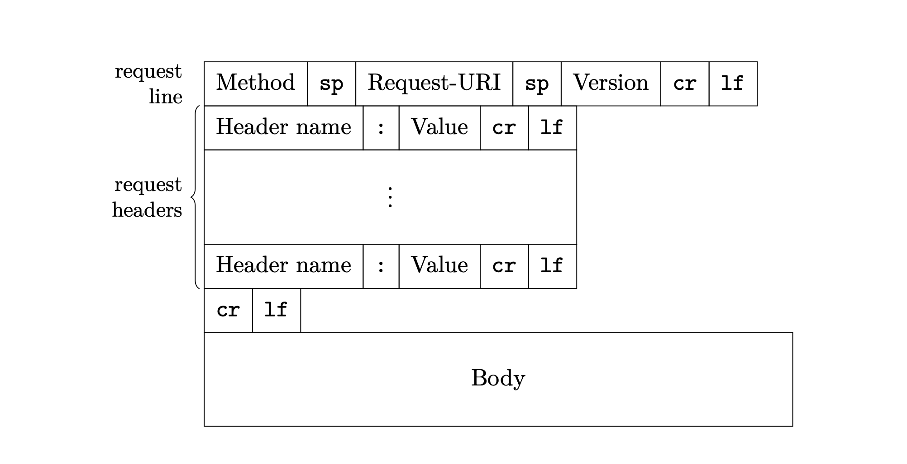
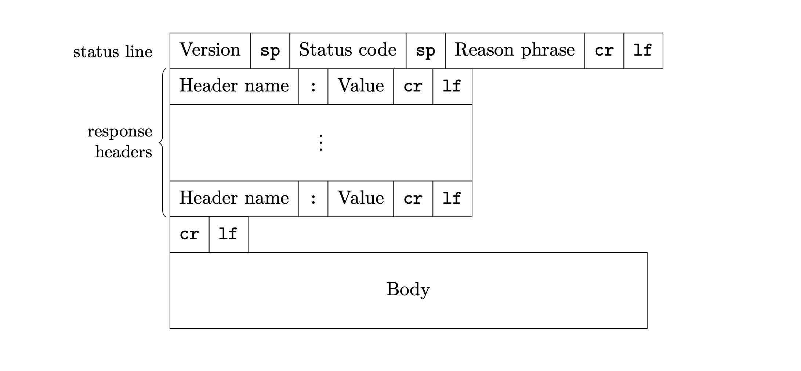
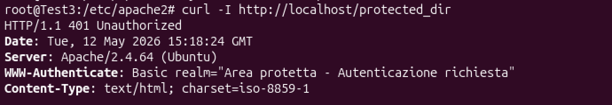
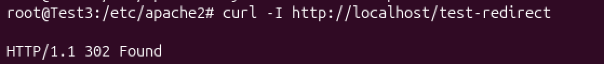

# Protocollo HTTP

## Indice 

[Teoria sul protocollo HTTP](#teoria-sul-protocollo-http)
- [ Fasi di comunicazione HTTP](#fasi-di-comunicazione-http)
- [URL (Uniform Resource Locator)](#url)
- [ Formato dei messaggi](#formato-dei-messaggi)
  - [Request message (Messaggio di richiesta)](#request-message)
  - [Response message (Messaggio di risposta)](#response-message)
- [ Status code (Codici di stato)](#status-code)

[Esercizio Status Code HTTP](#esercizio-status-code-http)
- [Introduzione all'Esercizio](#introduzione-allesercizio)
- [1. Creazione cartella riservata con pagina test](#1-creazione-cartella-riservata-con-pagina-test)
- [2. Creazione file .htpasswd e credenziali utente](#2-creazione-file-htpasswd-e-credenziali-utente)
- [3. Modifica del file di configurazione di Apache](#3-modifica-del-file-di-configurazione-di-apache)
- [4. Comandi per ottenere i diversi status code HTTP](#4-comandi-per-ottenere-i-diversi-status-code-http)
  - [401 Unauthorized](#401-unauthorized)
  - [200 Ok](#200-ok)
  - [301 Moved Permanently](#301-moved-permanently)
  - [302 Found](#302-found)
  - [404 Not Found](#404-not-found)


# Teoria sul protocollo HTTP
HTTP (_Hyper Text Transfer Protocol_) è un protocollo di livello applicativo che definisce come un client debba richiedere ad un server una risorsa specifica. 

## Fasi di comunicazione HTTP
HTTP è un protocollo basato su TCP e quando un client vuole acquisire una risorsa da un server, la comunicazione avviene tipicamente nel seguente modo:

1. Il client crea una _connessione_ TCP-IP con il server (usando di default la porta 80, se non diversamente indicato);

2. Il server in ascolto (sulla porta 80) accetta la richiesta di connessione e dà conferma la client;
3. Il client invia al server un messaggio di richiesta (**request message**) specificando l'indirizzo della risorsa;
4. Il server riceve il messaggio di richiesta e costruisce un messaggio di risposta (**response message**), che può contenete la risorsa richiesta o un messaggio d'errore, e lo invia;
5. Il client riceve il messaggio di risposta;
6. Il server _chiude_ la connessione TCP, subito dopo aver inviato la risposta.

## URL
Il metodo per identificare le risorse è fornito dagli URL (_Uniform Resource Locator_) ossia una sequenza di caratteri che identifica univocamente l'indirizzo di una risorsa in Internet. Essa contiene principalmente due informazioni:
* qual è il server a cui rivolgersi;
* qual è la risorsa di interesse all'interno del server.

In breve, la struttura di un URL è del tipo:

```text
protocollo://<username:password@>nome_host<:porta> </percorso><?query string><#fragment identifier>
```
Il `nome_host` e il `protocollo` devono essere specificati obbligatoriamente.

## Formato dei messaggi
Sia i _request message_ che i _response message_ sono messaggi di testo. Ciascuno è composto da un'intestazione (**header**) e da un corpo (**body**) che è facoltativo.

---
### Request message
---


In un messaggio di richiesta, l'header è a sua volta diviso in due parti:

1.  **Request line**, composta da
* *Method*: indica quale operazione deve essere eseguita sulla risorsa. Questo campo è case sensitive: il nome del metodo deve essere scritto in maiuscolo. Alcuni esempi sono:

  * `GET`: per richiedere una risorsa ed è previsto il passaggio di parametri direttamente nell’URL;
  * `POST`: per richiedere una risorsa ma i dettagli sono contenuti nel body del messaggio;
  * `DELETE`: si richiede la cancellazione della risorsa riferita nell’URL specificato;
  * `PUT`: per trasmettere delle informazioni al server, creando una nuova risorsa o sostituendola se già presente;
  * `OPTIONS`: per richiedere informazioni sulle opzioni della comunicazione.
* *URL* (o una Request-URI).
* *Versione del protocollo HTTP*.

2. **Request headers**
Sono delle copie `chiave:valore` separati dai due punti. Possono essere specificati anche più valori, separandoli con la virgola.

Ad esempio:
```http
Authorization: <type> <credentials>
```
* `Authorization` serve per inviare credenziali di autenticazione al server, consentendo l’accesso a risorse protette;
* `type` si riferisce allo schema di autenticazione, come Basic, Bearer, Digest ecc. Indica il metodo utilizzato per codificare o gestire le credenziali;
* `credentials` sono le credenziali utente codificate (o token di autenticazione). Formato e contenuto dipendono dallo schema di autenticazione.

<br>

**Body del request message**

Contiene i dati effettivi del messaggio. Può contenere, ad esempio, i dati di un form oppure può anche essere vuoto. 



---

### Response message

---

Il formato di risposta dei messaggi HTTP è simile a quello del messaggio di richiesta, anche qui l’header è diviso in due parti.

1. **Status line**, composta da
    * *Versione del protocollo HTTP*;
    * **Status Code**: codice a tre cifre che indica l’esito delle richieste;
    * Breve descrizione del significato dello status code.

2. **Response headers**
Descrive il body della risposta.

<br>

 **Body del response message**

Contiene i dati effettivi del messaggio, ad esempio una pagina HTML oppure anche dei dati strutturati in formato json come:
```json
{ "id":5 , "name": "John" }
```



##  Status code
In base alla prima cifra dello status code, si definiscono 5 classi di risposta:
* `1xx` **Informational**: richiesta ricevuta dal server ma ancora in elaborazione.
* `2xx` **Successful**: richiesta ricevuta, capita, e accettata dal server.
* `3xx` **Redirection**: il server ha ricevuto e capito la richiesta ma il client deve compiere ulteriori azioni per completare la richiesta.
* `4xx` **Client error**: la richiesta non può essere soddisfatta per errore da parte del client (errore sintattico o richiesta non autorizzata).
* `5xx` **Server error**: il server non è in grado di soddisfare la richiesta per un suo problema interno.

Alcuni status code comuni sono:
* `100` **Continue**: Se il client non ha ancora mandato il body.
* `200` **Ok**: GET con successo.
* `301` **Moved permanently**: URL non valida, il server non conosce la nuova posizione.
* `302` **Found**: Risorsa raggiungibile con un altro URL. L’URL tornerà valido in futuro. 
* `400` **Bad request**: Errore sintattico nella richiesta.
* `401` **Unauthorized**: Manca l’autorizzazione.
* `403` **Forbidden**: Richiesta non autorizzabile.
* `404` **Not found**: URL errato.
* `500` **Internal server error**: Il server non è in grado di rispondere per un solo problema interno.
* `501` **Not implemented**: Metodo non conosciuto dal server.

<br>

# Esercizio Status Code HTTP


## Introduzione all'esercizio

**Obiettivo**

Configuare un server web Apache per simulare, gestire e visualizzare diversi status code HTTP.  

I test verranno eseguiti e verificati direttamente da riga di comando sul server locale.

## 1. Creazione cartella riservata con pagina test

Da root:

*   `mkdir /var/www/html/protected_dir`
*   `echo "Area Riservata" > /var/www/html/protected_dir/index.html`


## 2. Creazione file .htpasswd e credenziali utente

Apache consente di proteggere particolari directory da accessi indesiderati degli utenti di sistema, per fare ciò si ricorre all'utilizzo del file .htpasswd: con il comando da root:

```bash
htpasswd -c /etc/apache2/.htpasswd pluto
```

Viene creato (con `-c`) il nuovo file `.htpasswd` in `/etc/apache2` e si crea il nuovo utente pluto. All'interno di questo file, la password dell'utente è sottoposta ad hashing.


## 3. Modifica del file di configurazione di Apache

Si modifica il file di configurazione `/etc/apache2/sites-enabled/000-default.conf` per il sito web predefinito, specificando che la directory `/var/www/html/protected_dir` deve essere protetta con autenticazione Basic: il client, che tenta di accedere alla risorsa protetta sul server, deve inviare nome utente e password in formato codificato base64 all'interno dell'header del messaggio di richiesta HTTP.

Con base64, le credenziali non sono criptate, ma solo codificate. Serve, ad esempio, per trasmettere dati con protocolli che utilizzano solo testo, come HTTP.

*   Si aggiunge la seguente riga tra i tag `<VirtualHost>`.

```apache
<Directory "/var/www/html/protected_dir">
    AuthType Basic
    AuthName "Area Protetta"
    AuthUserFile /etc/apache2/.htpasswd
    Require valid-user
</Directory>
```

*   Si abilita il modulo auth (sempre da root) con `a2enmod auth_basic` e si riavvia Apache.


## 4. Comandi per ottenere i diversi status code HTTP

### 401 Unauthorized

Con il comando:

```bash
curl -I http://localhost/protected_dir
```

**Comando e output**



*   Si esegue una richiesta (curl) HTTP, in questo caso, di tipo HEAD (`-I`) cioè che mostra solo 
l'header del messaggio di risposta (in cui si trova lo status code).

*   Il codice 401 deriva dal fatto che non sono state inviate credenziali di accesso alla risorsa protetta.
---
### 200 Ok

*   Genero le credenziali in base64 e visualizzo:

    ```bash
    echo -n "pluto:pluto_pass" | base64
    ```
*   Inserisco le credenziali nell'header del messaggio di richiesta usando `curl -H` per aggiungere la chiave `Authorization` 
e il valore dato dal tipo di autenticazione e le credenziali dell'utente codificate:

    ```bash
    curl -I -H "Authorization: Basic cG×1dG86cC×1dG9fcGFZcw==" http://localhost/protected_dir/
    ```
 **Comando e output**


---
### 301 Moved Permanently

*   Si modifica il file `/etc/apache2/sites-available/000-default.conf` inserendo nel tag `<VirtualHost>` la riga (e riavviando Apache):

    ```apache
    Redirect 301 /redirect301 http://localhost/
    ```
    Con la sintassi `Redirect <status_code> <parte_URL_client> <destinazione>` si indica che la URL richiesta dal client a partire 
    dalla root del sito (`http://localhost/`) viene reindirizzata verso una nuova destinazione, che nel nostro caso è la root stessa.
*   Si esegue il comando:

    ```bash
    curl -I http://localhost/redirect301
    ```

*   Il codice 301 viene restituito perché così è stato specificato nel file di configurazione e con esso si intende che la risorsa è stata definitivamente spostata.

 **Comando e output**


---

### 302 Found

*   Si modifica il file `/etc/apache2/sites-available/000-default.conf` inserendo nel tag `<VirtualHost>` la riga (e riavviando Apache):

    ```apache
    Redirect 302 /test-redirect http://localhost/
    ```
*   Si esegue il comando:

    ```bash
    curl -I http://localhost/test-redirect
    ```
*   Il codice 302 viene restituito perché così è stato specificato nel file di configurazione e con esso si intende che la risorsa è stata spostata temporaneamente.

 **Comando e output**



---

### 404 Not Found

*   Si esegue il comando:

    ```bash
    curl -I http://localhost/qualcosa_di_inesistente
    
    ```
*   Il codice 404 viene restituito perché Apache va cercare `/var/www/html/qualcosa_di_inesistente` ma non trova la risorsa richiesta.

 **Comando e output**


