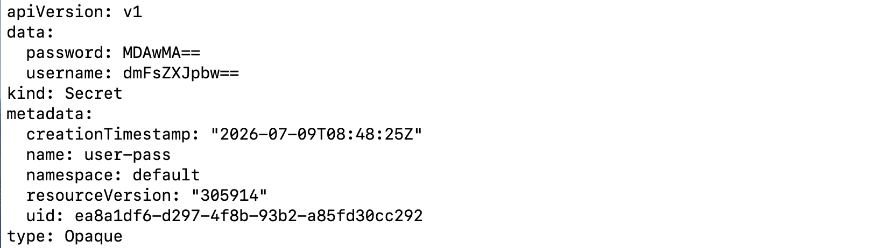
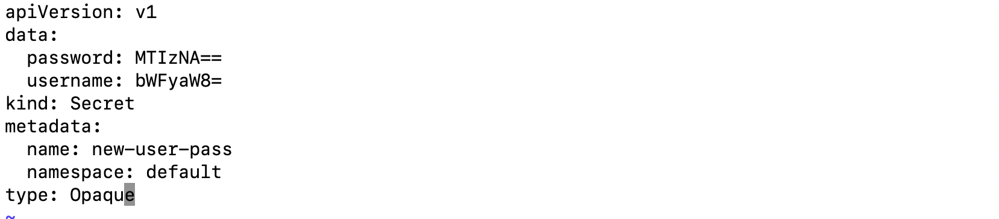
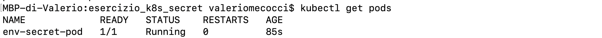
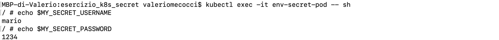

# Gestione dei Secret in Kubernetes

## Descrizione dell'esercizio

Gestire dei Secret in Kubernetes.

- Creare un Secret contenente utente e password attraverso l'opzione `--from-literal`
- Visualizzare il secret in formato Yaml. Salvare questo Yaml su un file e modificarlo per creare 
un nuovo Secret con altre credenziali (HINT: le credenziali vanno codificate in base64).
- Creare un Pod in cui uno dei Secret precedenti venga visto come variabili d'ambiente. Dare evidenza entrando dentro il Pod facendo l'echo della variabili.


## Creazione del Secret

Il primo Secret viene creato tramite il comando:

```bash
kubectl create secret generic user-pass \
  --from-literal=username=pippo \
  --from-literal=password=admin123
```


- `generic`

  indica che si tratta di un Secret generico (tipo `Opaque`).

- `user-pass`

  nome del Secret.

- `--from-literal`

  permette di specificare direttamente una coppia `chiave:valore`. Con 
  questa opzione, Kubernetes codifica i valori in Base64

In questo caso vengono create due chiavi:

```text
username=valerio

password=0000
```


---


Per visualizzare la rappresentazione YAML della risorsa:

```bash
kubectl get secret user-pass -o yaml

```




```yaml 
kind: Secret
```

Tipo della risorsa

---

```yaml
metadata:
  name: user-pass
```
Contiene le informazioni identificative della risorsa.


---


```yaml
type: Opaque
```
Tipo del Secret.

---


```yaml
data:
  password: MDAwMA==
  username: dmFsZXJpbw==
```

Contiene tutte le coppie chiave-valore.


## Esportazione del Secret

Con

```bash
kubectl get secret user-pass -o yaml > secret.yaml
```

salviamo il secret sul file `secret.yaml`


## Creazione di un secondo Secret tramite YAML

Una volta esportato il Secret, viene creato un secondo file `new-secret.yaml`
ottenuto copiando l'originale `secret.yaml`


## Perché modificare il file YAML?

Esistono due modi per creare risorse Kubernetes.

1. **Approccio imperativo**

    Attraverso comandi:

    ```bash
    kubectl create ...
    ```

    È utile per prove rapide.

2. **Approccio dichiarativo**

    Attraverso file YAML applicati con:

    ```bash
    kubectl apply -f file.yaml
    ```

    È l'approccio normalmente utilizzato negli ambienti di produzione perché i file possono essere:

    - salvati su Git;
    - revisionati;
    - modificati;
    - riutilizzati;
    - applicati automaticamente tramite pipeline CI/CD.


## Modifica del file

Nel file ca modificato il campo `name` in

```yaml
metadata:
  name: new-user-pass
```

perché in Kubernetes il nome identifica univocamente una risorsa all'interno del namespace.
 Laciare `name: user-pass` significa aggiornare il Secret esistente e non crearne uno nuovo, 
 come richiesto.

Successivamente vengono cambiate username e password e, poiché `data` accetta solo
valori Base64, è ora necessario codificarli manualmente, copiarli e incollarli nel file
`new-secret.yaml`


```bash
echo -n "mario" | base64
bWFyaW8=

echo -n "1234" | base64
MTIzNA==
```


## Pulizia dei metadati

Quando abbiamo esportato il Secret, abbiamo esportato anche tutte le informazioni 
che Kubernetes ha aggiunto durante la creazione quella risorsa. Ma se vogliamo creare una nuova risorsa, 
queste info generate in automatico non devono essere copiate.


Questi campi devono essere eliminati:

```yaml
creationTimestamp:
resourceVersion:
uid:
```

Applicando tutte le modifiche descritte, il nuovo secret sarà




## Applicazione del nuovo Secret

Una volta modificato il file, si digita il comando

```bash
kubectl apply -f new-secret.yaml
```

`apply` è il comando consigliato nel modello dichiarativo.

Successivamente, con  

```bash
kubectl get secrets
```
verifichiamo che il nuovo segreto sia stato creato.


## Creazione del Pod

Il Pod viene definito tramite il file `env-secret-pod.yaml`


```yaml
apiVersion: v1
kind: Pod

metadata:
  name: env-secret-pod

spec:
  containers:
    - name: env-secret-container
      image: alpine
      command: ["sleep", "3600"]

      env:
        - name: MY_SECRET_USERNAME
          valueFrom:
            secretKeyRef:
              name: new-user-pass
              key: username

        - name: MY_SECRET_PASSWORD
          valueFrom:
            secretKeyRef:
              name: new-user-pass
              key: password
      
```


## Analisi delle parti principali del Pod

### `metadata` 

È il nome del Pod che useremo per entrare nel container.

---

### `spec`

Descrive come deve essere il Pod: tutto ciò che deve essere creato viene specificato qui.

```yaml
containers:
    - name: env-secret-container
      image: alpine
      command: ["sleep", "3600"]
```

Specifica il nome del container, l'immagine Docker da utilizzare e, 
poiché Alpine non ha un processo che rimane in esecuzione, dobbiamo specificare che esso rimanga attivo
per un'ora.

---


### `env`

Definisce le variabili d'ambiente disponibili nel container.


```yaml
- name: MY_SECRET_USERNAME
          valueFrom:
            secretKeyRef:
              name: new-user-pass
              key: username

```

- ` MY_SECRET_USERNAME` è il nome della variabile d'ambiente che vedremo nel container.

- `valueFrom` indica che il valore della variabile non è scritto direttamente
 nel file YAML ma deve essere recuperato da un'altra risorsa.

- `secretKeyRef` specifica quale Secret utilizzare: quello di nome `new-user-pass` e prende il valore 
associato alla chiave `username`.


## Creazione del Pod

Il Pod viene creato tramite:

```bash
kubectl apply -f env-secret-pod.yaml
```

Successivamente è possibile verificarne lo stato:

```bash
kubectl get pods
```



---

## Output finale


Entrando nel container con

```bash
kubectl exec -it env-secret-pod -- sh
```
Possiamo stampare sullo schermo il valore delle variabili


