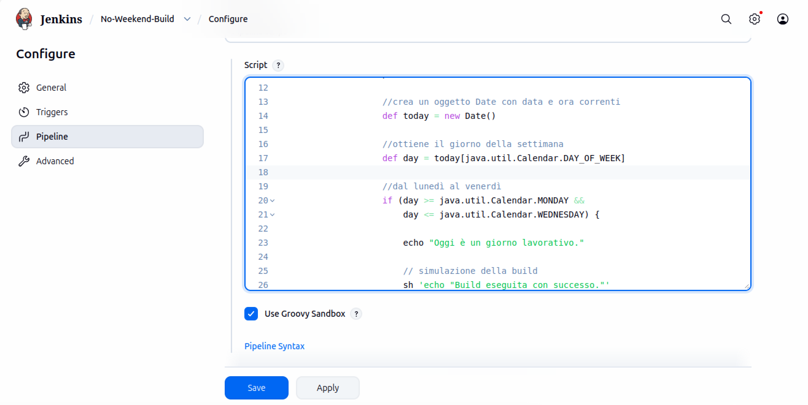
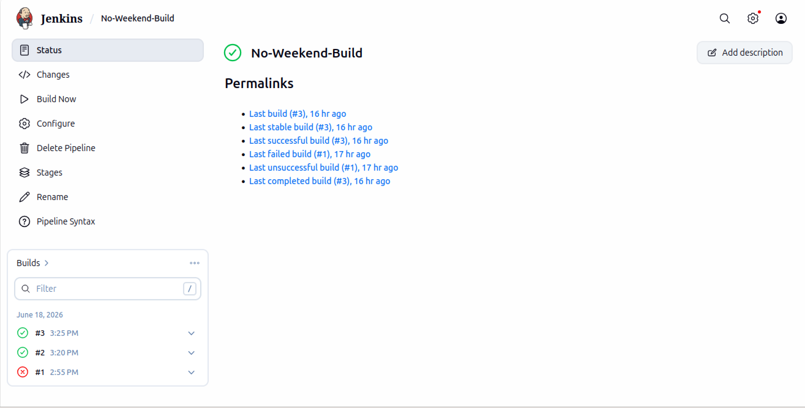
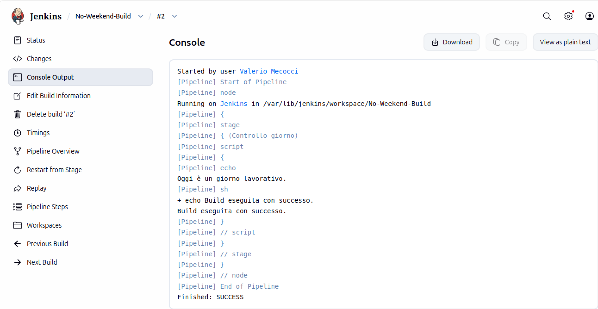

# Jenkins - Pipeline con controllo del giorno della settimana

## Obiettivo

L'obiettivo dell'esercizio è realizzare una Pipeline Jenkins che esegua una build solo dal lunedì al venerdì e che, durante il fine settimana, mostri un messaggio di warning senza eseguire la build.

L'esercizio richiede inoltre che il giorno della settimana non venga ricavato tramite un comando della shell Linux (ad esempio `date`), ma utilizzando l'oggetto `Date` fornito dal linguaggio Groovy, sul quale si basano le Pipeline di Jenkins.

---

## Cos'è Jenkins

_Jenkins_ è un server di _Continuous Integration_ (CI) e _Continuous Delivery/Deployment_ (CD) che permette di automatizzare attività ripetitive come:

* compilazione di un progetto;
* esecuzione di test automatici;
* creazione di immagini Docker;
* deploy di applicazioni;
* esecuzione di script e comandi sul sistema operativo.

Jenkins consente quindi di definire una sequenza di operazioni che possono essere eseguite automaticamente oppure manualmente tramite la sua interfaccia web.

L'unità di lavoro fondamentale di Jenkins è il _Job_, ovvero un'attività che il server può eseguire. Ogni Job descrive un determinato processo e può essere configurato in modi diversi (ad esempio come _Freestyle Job_ oppure come _Pipeline_), a seconda del livello di complessità e flessibilità richiesto.

Durante l'esecuzione di un Job viene avviata una _build_, cioè l'istanza di esecuzione del processo definito dal Job. Una build può comprendere operazioni come la compilazione del codice, l'esecuzione di test o la creazione di artefatti.

---

## Architettura utilizzata

Per questo esercizio, Jenkins è stato installato direttamente su una macchina virtuale Ubuntu.
I comandi eseguiti dalla Pipeline vengono eseguiti direttamente sulla macchina virtuale in cui è installato Jenkins.

L'interfaccia web serve solamente per creare, configurare ed eseguire le pipeline.

---

## Cos'è una Pipeline

Una _Pipeline_ rappresenta il flusso di lavoro che Jenkins deve eseguire.

Può essere vista come una sequenza di fasi (_stage_), ognuna delle quali contiene una serie di operazioni (_steps_).

Rispetto ai classici _Freestyle Job_ , configurati principalmente attraverso l'interfaccia grafica di Jenkins in cui 
l'utente aggiunge le operazioni da eseguire tramite le opzioni messe a disposizione dalla pagina di configurazione,
 una Pipeline descrive il processo di build come codice.


---

## Il Jenkinsfile

La definizione di una Pipeline viene normalmente salvata in un file chiamato `Jenkinsfile` che descrive come Jenkins deve eseguire il proprio processo di build.

Nel corso di questo esercizio la Pipeline è stata inizialmente scritta tramite l'interfaccia web di Jenkins e successivamente salvata in un file `Jenkinsfile`, così da poter essere versionata tramite Git.

---

## Pipeline realizzata

```groovy
pipeline {

    agent any

    stages {

        stage('Controllo giorno') {

            steps {

                script {

                    def today = new Date()

                    def day = today[java.util.Calendar.DAY_OF_WEEK]

                    if (day >= java.util.Calendar.MONDAY &&
                        day <= java.util.Calendar.FRIDAY) {

                        echo "Oggi è un giorno lavorativo."

                        sh 'echo "Build eseguita con successo."'

                    } else {

                        echo "WARNING: Oggi è sabato o domenica. La build non verrà eseguita."

                    }

                }

            }

        }

    }

}
```

---

## Analisi della Pipeline

 `pipeline { }`

È il blocco principale che indica a Jenkins che il codice contenuto al suo interno rappresenta una Pipeline
e Jenkins dovrà eseguire ciò che è definito all'interno di questo blocco.

---

 `agent any`

L'_agent_ rappresenta la macchina sulla quale Jenkins eseguirà la Pipeline.

`agent any` significa che questa Pipeline verrà eseguita su qualunque agente disponibile che, nel nostro caso,
è la macchina virtuale Ubuntu sulla quale è installato Jenkins (ed è l'unicol agent).

---

 `stages { }`

È la fase logica della Pipeline: rappresenta un momento ben preciso del processo di build.


---

 `stage('Controllo giorno')`

Uno stage rappresenta una singola fase della Pipeline.

Il nome di questa fase, specificato tra parentesi, è quello che verrà mostrato nell'interfaccia grafica
di Jenkins durante l'esecuzione.


---

`steps { }`

All'interno di uno stage vengono definiti gli step
che rappresentano una singola operazione che Jenkins deve eseguire.


---

`script { }`

Le _Declarative Pipeline_ (basate su un paradigma di programmazione dichiarativo) permettono di utilizzare alcuni step predefiniti di Jenkins.

Quando però è necessario scrivere del codice Groovy, occorre utilizzare il blocco:

```groovy
script {

}
```

Questo blocco permette di scrivere codice Groovy all'interno della Pipeline.

---

## Utilizzo di Groovy

_Groovy_ è un linguaggio orientato agli oggetti e fortemente integrato con la JVM (Java Virtual Machine), caratterizzato da una sintassi dinamica, concisa ed estensibile tramite DSL ( cioè permette di definire una sintassi personalizzata - _Domain Specific Language_ - per semplificare un compito specifico, nascondendo il codice complesso sottostante).

### Creazione dell'oggetto Date

```groovy
def today = new Date()
```

`def` viene utilizzato per dichiarare una variabile.

`new Date()` crea un nuovo oggetto di tipo `Date` contenente la data e l'ora correnti. L'oggetto `Date` appartiene 
alle librerie standard di Java ed è utilizzabile direttamente anche da Groovy.

---

### Ottenere il giorno della settimana

```groovy
def day = today[java.util.Calendar.DAY_OF_WEEK]
```

Per ottenere il giorno della settimana viene utilizzata la classe `java.util.Calendar`

La costante `DAY_OF_WEEK` permette di recuperare il giorno corrente sotto forma di valore numerico.

La corrispondenza è la seguente: SUNDAY --> 1, MONDAY --> 2 e così via.


In questo modo non è stato necessario utilizzare il comando Linux `date`, come richiesto dall'esercizio.

---

### La condizione `if`

```groovy
if (day >= java.util.Calendar.MONDAY &&
    day <= java.util.Calendar.FRIDAY)
```

La condizione verifica se il giorno corrente è compreso tra lunedì e venerdì.

In caso affermativo viene eseguita la build.

In caso contrario viene mostrato solamente un messaggio di warning.

---

### Lo step `echo`

```groovy
echo "Oggi è un giorno lavorativo."
```

`echo` è uno _step di Jenkins_ che serve a scrivere messaggi nel log della Pipeline.

_Non corrisponde al comando Linux `echo`!_

---

### Lo step `sh`

```groovy
sh 'echo "Build eseguita con successo."'
```

Lo step `sh` apre una shell Linux sulla macchina che esegue Jenkins e lancia il comando specificato.

Nel nostro caso la build è solamente simulata tramite il comando:

```bash
echo "Build eseguita con successo."
```

---

## Risultato finale








