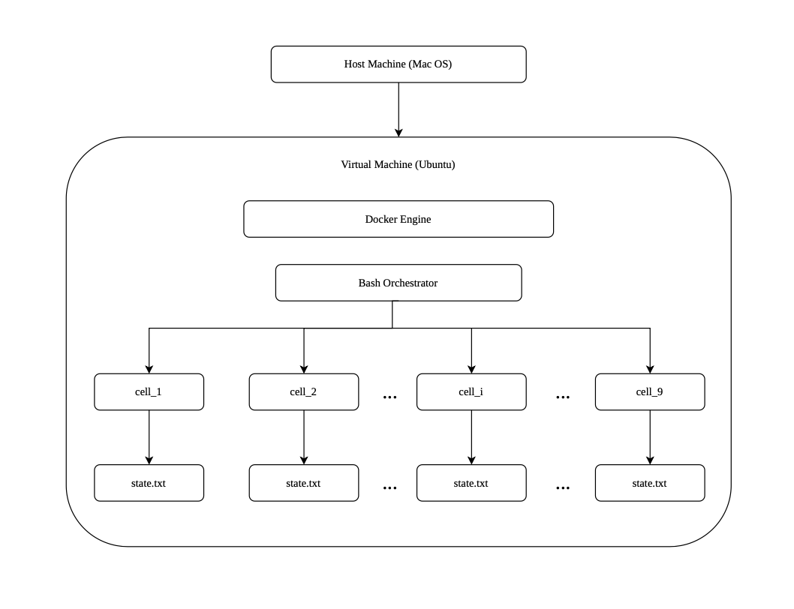
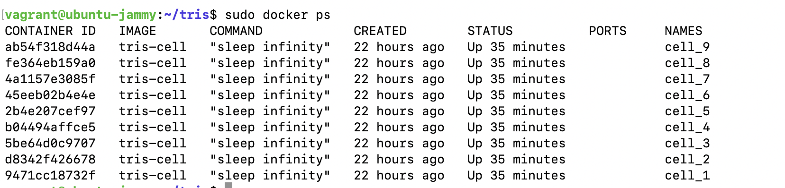
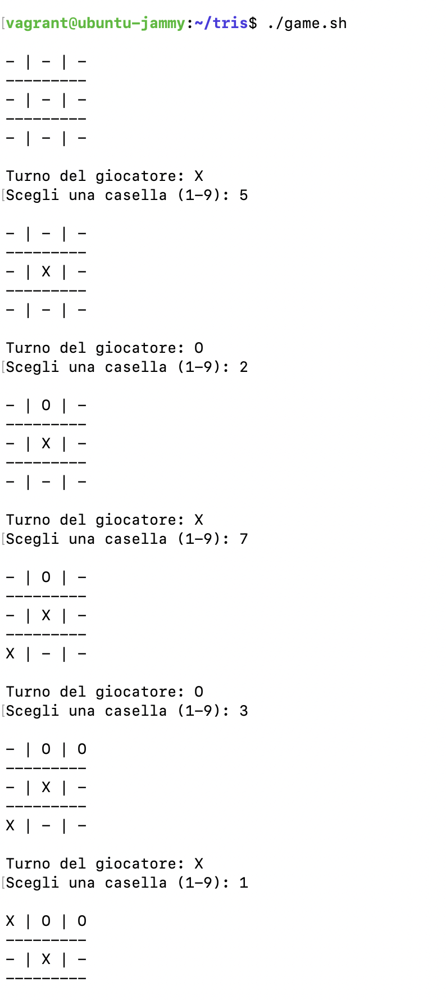
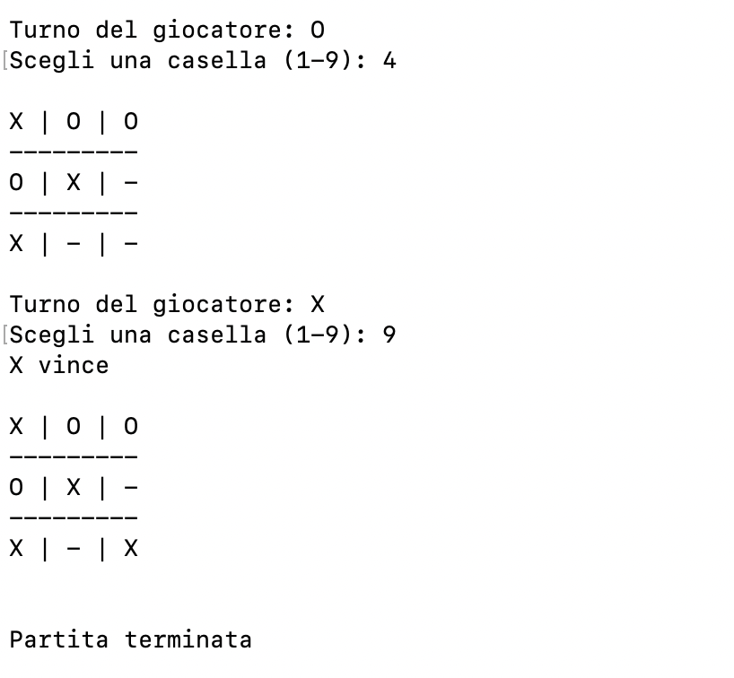

# Tris Distribuito con Vagrant e Docker

## Indice
* [Architettura](#architettura)
* [Specifiche del gioco e requisiti](#specifiche-del-gioco-e-requisiti)
    * [Regole](#regole)
    * [Stati ammissibili](#stati-ammissibili)
    * [Vincoli](#vincoli)
* [Idea principale dell'implementazione](#idea-principale-dellimplementazione)
  * [Il concetto di sistema distribuito](#il-concetto-di-sistema-distribuito)
* [Creazione struttura del progetto](#creazione-struttura-del-progetto)
  * [Vagrant](#vagrant)
  * [Docker](#docker)
  * [Orchestratore](#orchestratore)
  * [Pseudocodice dell'orchestratore](#pseudocodice-dellorchestratore)
* [Implementazione dell'orchestratore in Bash](#implementazione-dellorchestratore-in-bash)
* [Discussione sulla gestione dei container](#discussione-sulla-gestione-dei-container)
* [Output della partita](#output-della-partita)

## Architettura
In questa versione del progetto, il gioco del Tris viene modellato utilizzando macchine virtuali, container Docker e orchestrazione tramite Bash.

* **Livello Infrastrutturale**: La virtualizzazione viene utilizzata attraverso Vagrant. La macchina virtuale rappresenta il livello infrastrutturale su cui verrà installato Docker.

* **Containerizzazione**: All'interno della macchina virtuale viene utilizzato Docker per la containerizzazione. 
Nel progetto del Tris vengono creati nove container, uno per ogni casella della griglia e ogni container rappresenta una singola cella.

* **Ambiente Operativo**: La VM fornisce un ambiente operativo completo, mentre i container rappresentano unità isolate che eseguono il compito specifico.

* **Stato Locale**: Ogni container mantiene il proprio stato locale attraverso un file, `state.txt`. Questo file rappresenta il contenuto della casella del Tris.



## Specifiche del gioco e requisiti

### Regole

Il _Tris_ (o _Tic-Tac-Toe_) è un gioco non cooperativo per due giocatori ed è _deterministico_ (un determinato insieme di strategie conduce invariabilmente a un certo esito) e ad _informazione completa_ (ogni giocatore, quando effettua ogni sua mossa, è informato di tutte le sue mosse precedenti, quelle degli altri giocatori e delle loro conseguenze).

* **Obiettivo**: Il primo giocatore che riesce a disporre tre dei propri simboli in linea retta (in orizzontale, verticale o diagonale) vince la partita.
* **Svolgimento**: I giocatori si alternano posizionando il proprio simbolo (X o O) in una delle caselle vuote della griglia 3×3.
* **Pareggio**: Se tutte e 9 le caselle vengono riempite senza che nessuno abbia allineato tre simboli, la partita termina in pareggio.

### Stati ammissibili

* Se il file `state.txt` è vuoto significa che la casella è libera;

* Se il file contiene `X` allora la casella è occupata da `X`;

* Se il file contiene `O` la casella è occupata da `O`.


### Vincoli

* Solo `X` e `O` sono simboli ammissibili;

* Se c'è `X` nel file, non si può scrivere `O`;

* I turni devono essere alternati `X` → `O` → `X` → …;

* Ci sono massimo 9 turni.

## Idea principale dell'implementazione
Lo stato non viene salvato in un unico file centrale ma è distribuito nei vari container. 
La griglia del Tris non esiste come un’unica entità salvata da qualche parte, 
ma la griglia completa emerge dalla somma degli stati locali dei nove container. 

Per conoscere la situazione della partita bisogna interrogare ogni container e leggere il valore del suo file: 
la griglia dovrà quindi essere ricostruita dinamicamente dall’orchestratore leggendo gli stati distribuiti.


### Il concetto di sistema distribuito

In un _sistema distribuito_ le informazioni non sono centralizzate ma suddivise tra più nodi indipendenti: 
ogni nodo possiede una parte dello stato globale e il sistema completo esiste solo grazie alla cooperazione tra tutti i nodi. 

Nel progetto, i nove container rappresentano quindi i nodi distribuiti, mentre la griglia finale è, 
come detto, il risultato dell’insieme dei loro stati locali.

L’orchestratore agisce come un supervisore del sistema distribuito:
quando un giocatore effettua una mossa, Bash individua il container corrispondente alla casella scelta e scrive il simbolo nel file interno del container.
Successivamente legge tutti gli stati per ricostruire la griglia e verificare se esiste una delle 8 combinazioni vincenti.

---


## Creazione struttura del progetto

    tris/
    ├── cell-image/              # immagine Docker delle celle
    │   └── Dockerfile           # definizione dell'immagine tris-cell
    │
    ├── containers/
    │   ├── cell_1
    │   ├── cell_2
    │   ├── cell_3
    │   ├── cell_4
    │   ├── cell_5
    │   ├── cell_6
    │   ├── cell_7
    │   ├── cell_8
    │   └── cell_9
    │
    └── game.sh                  # orchestratore centrale del gioco

### Vagrant
---

Sulla macchina host si crea la cartella `tris-project/` all'interno della quale metteremo il `Vagrantfile` in cui verrà indicato:
* quale VM creare;
* quale sistema operativo usare;
* configurazioni iniziali.

```ruby
Vagrant.configure("2") do |config|

  config.vm.box = "ubuntu/jammy64"

  config.vm.provider "virtualbox" do |vb|
    vb.gui = false
    vb.memory = "1024"
    vb.cpus = 1
  end

end

```

Si avvia la VM con `vagrant up` e si entra in essa con `vagrant ssh`.

### Docker
---
Con i seguenti comandi si installa e avvia Docker sulla VM Ubuntu:

```bash
sudo apt update
sudo apt install docker.io -y
sudo systemctl start docker
```
Inoltre, dentro alla VM creiamo la cartella `tris/` nella quale ci sarà la cartella immagine `cell-image/` che 
conterrà il `Dockerfile` il quale descrive:

* come costruire l’immagine;
* quali file inserire;
* quali comandi eseguire.


```dockerfile
FROM ubuntu:22.04
#l'immagine parte da ubuntu

RUN mkdir /game
#si crea la cartella /game

RUN touch /game/state.txt
#si crea il file di stato locale

CMD ["sleep", "infinity"]
#il container resta attivo
```

L'idea, infatti, è quella di non creare 9 immagini diverse ma _una sola immagine riutilizzata_ 9 volte.  

Dentro `cell-image/`, effettuiamo il _build_ dell'immage eseguendo:

```bash
sudo docker build -t tris-cell .
```
Così Docker:
* legge il Dockerfile;
* crea filesystem immagine;
* salva immagine chiamata `tris-cell`.

Ora, tornando alla cartella principale, creiamo manualmente i container:

```bash
sudo docker run -dit --name cell_1 tris-cell
sudo docker run -dit --name cell_2 tris-cell
sudo docker run -dit --name cell_3 tris-cell
sudo docker run -dit --name cell_4 tris-cell
sudo docker run -dit --name cell_5 tris-cell
sudo docker run -dit --name cell_6 tris-cell
sudo docker run -dit --name cell_7 tris-cell
sudo docker run -dit --name cell_8 tris-cell
sudo docker run -dit --name cell_9 tris-cell
```

Ogni comando:

* crea container;
* assegna nome `cell_i` per i = 1,...,9;
* avvia container;
* lo mantiene attivo.

Quindi 9 container _indipendenti_ ognuno con file di stato locale `/game/state.txt`.

  

**Nota**. Alla fine del README, in [Discussione sulla gestione dei container](#discussione-sulla-gestione-dei-container), si spiegherà questa scelta.


### Orchestratore 
---

L'orchestratore agisce come supervisore del sistema distribuito e si occupa di:
* inizializzare la griglia di gioco;
* chiedere la mossa che intende fare il giocatore;
* validare la mossa;
* scrivere lo stato della partita;
* verificare la vittoria di un giocatore o il pareggio;
* alternare i turni.

All'interno della cartella `tris/` creiamo il file `game.sh` e lo rendiamo eseguibile.

---
### Pseudocodice dell'orchestratore

```javascript
INIZIO

Siano cell_1, ... ,cell_9 i 9 container creati

PER OGNI container, RIPETI:
    svuota il file state.txt


partita_attiva = true
mosse = 0
turno = X

// Ciclo principale della partita
FINTANTO CHE partita_attiva = true

    STAMPA griglia corrente

    chiedi al giocatore di scegliere una casella

    verifica se la casella è valida 
       
    scrivi simbolo nel container corrispondente

    mosse = mosse + 1

    ricostruisci griglia leggendo tutti i container

    verifica combinazioni vincenti

    SE X ha vinto:
        STAMPA "X vince"
        partita_attiva = false

    ALTRIMENTI, SE O ha vinto:
        STAMPA "O vince"
        partita_attiva = false

    ALTRIMENTI, SE mosse == 9:
        STAMPA "Pareggio"
        partita_attiva = false

    ALTRIMENTI:
        cambia turno:
            X -> O
            O -> X
    FINE CONDIZIONE

FINE CICLO


// Validazione casella
LEGGI il file /game/state.txt del container 
SE /game/state.txt è vuoto
    la mossa è valida
FINE CONDIZIONE


// Scrittura della mossa nella casella
entra nel container scelto
SCRIVI X oppure O dentro state.txt


// Ricostruzione della griglia
LEGGI il valore c1 dentro cell_1/state.txt
LEGGI il valore c2 dentro cell_2/state.txt
...
LEGGI il valore c9 dentro cell_9/state.txt
aggrega gli stati 
    c1 | c2 | c3   
    ------------
    c4 | c5 | c6   
    ------------
    c7 | c8 | c9


// Verifica delle combinazioni vincenti
SE c1, c2, c3 non vuoti e c1 = c2 = c3 = X (oppure O) //prima riga
    X vince (oppure O vince)
FINE CONDIZIONE

SE c4, c5, c6 non vuoti e c4 = c5 = c6 = X (oppure O)//seconda riga
    X vince (oppure O vince)
FINE CONDIZIONE

si procede con tutte le righe, colonne e diagonali

FINE
```

## Implementazione dell'orchestratore in Bash


Lo script inizializza la griglia di gioco con la funzione `initialize_board()` perché i container mantengono il loro
 stato anche dopo che lo script orchestratore è terminato, quindi, quando si rilancia `./game.sh`
la partita precedente è ancora presente.

Poi inizia il ciclo principale che si ripete fintanto che il flag `partita_attiva` è vero. Questo diventa falso nel caso
in cui uno tra i giocatori `X` e `O` vince, oppure si ha un pareggio.

Dopodiché la funzione `read_board()` legge il contenuto dei file nel container i-esimo e lo salvo nella variabile ci, i=1,...,9

```bash
c1=$(sudo docker exec cell_1 cat /game/state.txt)
```
e se la variabile è vuota, assegna il carattere `-`.

Successivamente stampa la griglia con la funzione `read_board()` e poi con `get_player_move()` chiede al giocatore di scegliere una
casella da 1 a 9 ( in questa implementazione starà al giocatore capire dalla griglia quali sono le caselle ancora disponibili)
e validerà l'input e l'effettiva disponibilità della casella scelta.

Se effettivamente la mossa è valida, con la funzione `write_move()` si andrà ad aggiornare lo stato locale del container 
scrivendo `X` o `O` nel file nella cella i-esima con

```bash
sudo docker exec cell_$1 sh -c "echo $2 > /game/state.txt"
```
dove `$1` è il numero di casella passato alla funzione e `$2` è il turno del giocatore, ossia `X` o `O`.

Una volta fatta la mossa, il contatore viene incrementato (perché si possono fare massimo 9 mosse, una per casella), si 
ristampa la griglia aggiornata e poi si verifica il vincitore con la funzione `check_winner()` che 
cerca tre caselle non vuote (tra le righe, le colonne e le diagonali della griglia) che abbiano tutte lo stesso simbolo: 
il vincitore, nella variabile `winner`, sarà colui che ha inserito quel simbolo. Se queste caselle non vengono trovate
si imposterà `winner=""`.

Il ciclo principale termina quando viene richiamata la funzione `end_game()` che dichiara il nome del vincitore (o il pareggio), mostra la 
griglia e imposta il flag `partita_attiva=false`. Se il vincitore non è stato ancora trovato, allora si richiama la
funzione `switch_turn()` che alterna semplicemente i turni reimpostando la variabile `turno`. 

Lo script termina in ogni caso quando il numero delle mosse arriva a 9.

<br>

## Discussione sulla gestione dei container

I container mantengono il loro stato anche dopo che lo script orchestratore è termianto, quindi, quando si rilancia `./game.sh`
la partita precedente è ancora presente; infatti ogni container possiede un proprio filesystem e `state.txt` persiste 
finché esiste il container. In poche parole, il container _conserva il proprio stato interno_.

### Alcune possibili soluzioni

1. **Reset infrastrutturale**.

    All'inzio dello script si distruggono i container precedenti e se ne creano di nuovi, così che i file
    `state.txt` tornino vuoti. Concettualmente, qui si sta resettando l'infrastruttura distribuita 

    Con questa versione dell'orchestratore, al posto della funzione `initialize_board()`, si avrà la funzione:

    ```bash
    remove_containers() {
        for i in {1..9}
        do
            sudo docker rm -f cell_$i >/dev/null 2>&1
        done
    }
    ```
    che prova ad eliminare i container e, se non esistono, ignora il messaggio.

    Poi abbiamo:

    ```bash
    create_containers() {
        for i in {1..9}
        do
            sudo docker run -dit --name cell_$i tris-cell >/dev/null
        done
    }
    ```
    Per la creazione dei nuovi `cell_i`.

    Quindi all'inizio non servirà più creare manualmente i container perché è l'orchestratore stesso 
    a gestire il ciclo di vita dei container.

    **Vantaggi**: isolamento dei container e orchestrazione del loro ciclo di vita.

    **Svantaggi**: molti `docker run` per ricreare tutto l'ambiente comportano lentezza.


<br>


2.  **Reset logico del sistema**.

    All'inzio dello script si azzerano solo i file  `state.txt`. Concettualmente, si mantiene l'infrastruttura
    ma si resetta lo stato locale. Questo è il caso della nostra versione con funzione `initialize_board()`.

    Questo approccio simula i _sistemi stateful_ con nodi persistenti. Nostro caso, infatti, abbiamo 9 nodi che rappresentano 
    sempre una casella nella griglia del Tris, quindi ci si focalizza più sui sistemi distribuiti che non sul ciclo di 
    vita dell'orchestrazione dei container.

    **Nota**. In questo caso i container `cell_1`, `cell_2` ecc. esisteranno ancora dopo che lo script `game.sh` sarà terminato, ma 
    bisogna fare attenzione perché lo script presuppone che i container siano già in esecuzione: se si spegne la VM o si riavvia Vagrant oppure Docker ferma i container, essi si troveranno nello stato `Exited` (si può controllare con il comando
    `sudo docker ps -a`) e quindi andranno riavviati con 

    ```bash 
    sudo docker start cell_1 cell_2 cell_3 cell_4 cell_5 cell_6 cell_7 cell_8 cell_9
    ```

---

## Output della partita





