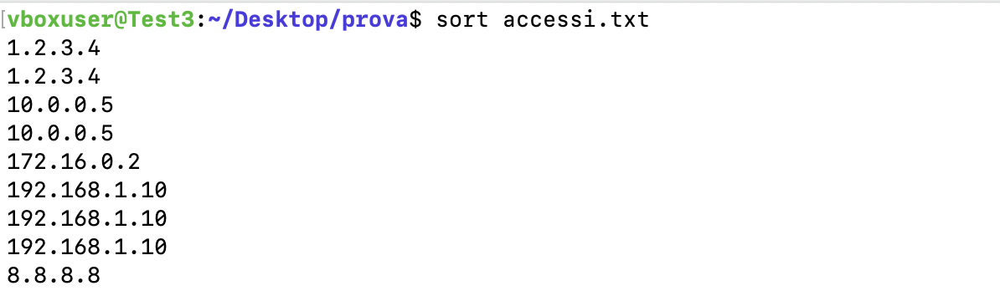
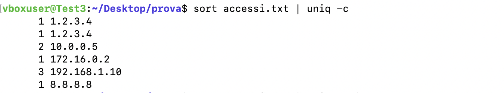
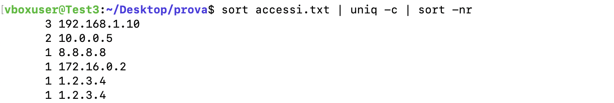
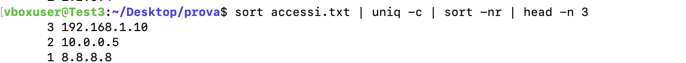

# Manipolazione del Testo e Automazione in Bash

## Descrizione del problema

Un server aziendale ha subito un picco anomalo di traffico. Nella directory di lavoro è presente un file denominato `accessi.txt`, nel quale ogni riga contiene esclusivamente l'indirizzo IP di un host che ha effettuato una connessione al server. Molti indirizzi IP si ripetono più volte

## Obiettivo
Lo scopo dell'esercizio è individuare i **3 indirizzi IP più frequenti**, mostrando nel terminale:

* il numero di occorrenze dell'indirizzo IP;
* l'indirizzo IP stesso;
* i risultati ordinati dal più frequente al meno frequente.


## Soluzione adottata

Per risolvere il problema è stata utilizzata la seguente pipeline di comandi Unix, in modo da sfruttare strumenti già disponibili nei sistemi Linux.


```bash
sort accessi.txt | uniq -c | sort -nr | head -n 3
```


## Spiegazione della soluzione

La soluzione è composta da quattro comandi concatenati tramite il carattere  _pipe_ `|` (pipe) che permette di fornire in input al comando di destra l'output del comando di sinstra.

### 1. Ordinamento del file

```bash
sort accessi.txt
```

Il comando `sort` ordina alfabeticamente tutte le righe del file.

Infatti se digitiamo del terminale `sort accessi.txt`, avremo




Dato che il comando `uniq` è in grado di riconoscere e contare solamente le righe duplicate adiacenti, è necessario ordinare il file prima di dare questo comando.

---

### 2. Conteggio delle occorrenze

```bash
uniq -c
```

L'opzione `-c` (_count_) conta quante volte compare ciascuna riga consecutiva.

Possiamo vedere un output intermedio digitando  `sort accessi.txt | uniq -c` nella cartella principale. 




---

### 3. Ordinamento per frequenza

```bash
sort -nr
```

Il risultato precedente viene ordinato nuovamente utilizzando due opzioni:

* `-n` effettua un ordinamento numerico;
* `-r` inverte l'ordine, ottenendo i valori maggiori per primi.

Se digitiamo  `sort accessi.txt | uniq -c | sort -nr`, abbiamo




---

### 4. Selezione dei primi tre risultati

```bash
head -n 3
```

Il comando `head` con l'opzione `-n 3` mostra soltanto le prime tre righe dell'input ricevuto.

Come output finale, digitando l'intero comando `sort accessi.txt | uniq -c | sort -nr | head -n 3`, abbiamo 




---

## Discussione della soluzione

Il problema può essere risolto anche tramite cicli Bash o array associativi. Tuttavia, la pipeline Unix rappresenta la soluzione più lineare in ambiente Linux, infatti  ogni passaggio svolge un singolo compito ben definito utilizzando strumenti ottimizzati e consolidati del sistema operativo.

