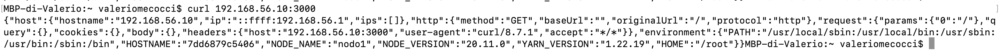

# Vagrant Ping Pong Container

Progetto realizzato con Vagrant e Docker.

L'obiettivo è creare un ambiente a due nodi Linux in cui un container Docker venga eseguito alternativamente su una sola macchina virtuale alla volta, simulando una migrazione "ping pong" ogni 60 secondi.

Container utilizzato:

https://hub.docker.com/r/ealen/echo-server

<br>

## Architettura

```text
Mac Host
│
├── Vagrantfile
├── setup.sh
└── pingpong.sh
       │
       ├── nodo1 (Ubuntu + Docker)
       └── nodo2 (Ubuntu + Docker)
```

Il container Docker viene eseguito:

```text
60 secondi su nodo1 --> 60 secondi su nodo2 --> 60 secondi su nodo1 --> ...
```

<br>

## Tecnologie utilizzate

* Vagrant
* VirtualBox
* Ubuntu 24.04
* Docker
* Bash scripting


## Vagrantfile

Il file `Vagrantfile` descrive l'infrastruttura del progetto.

Contiene:

* definizione delle VM
* configurazione networking
* provisioning automatico
* assegnazione hostname
* rete privata tra nodi

---

### Codice del Vagrantfile

```ruby
Vagrant.configure("2") do |config|

  config.vm.box = "bento/ubuntu-24.04"

  #nodo 1
  config.vm.define "nodo1" do |nodo1|

    nodo1.vm.hostname = "nodo1"

    nodo1.vm.network "private_network",
      ip: "192.168.56.10"

    nodo1.vm.provision "shell",
      path: "setup.sh"

  end

  #nodo 2
  config.vm.define "nodo2" do |nodo2|

    nodo2.vm.hostname = "nodo2"

    nodo2.vm.network "private_network",
      ip: "192.168.56.11"

    nodo2.vm.provision "shell",
      path: "setup.sh"

  end

end
```

 **private_network**

```ruby
nodo1.vm.network "private_network",
ip: "192.168.56.10"
```

Crea una rete privata tra le VM che permette alle macchine di comunicare direttamente tramite IP interni.

---

**Provisioning**

```ruby
config.vm.provision "shell",
path: "setup.sh"
```
Dopo aver creato la VM, si esegue `setup.sh` che automatizza la configurazione della macchina.

---

## setup.sh

Lo script `setup.sh` installa Docker automaticamente su entrambe le VM.


```bash
#!/bin/bash

# aggiorna pacchetti
apt-get update

# installa docker
apt-get install -y docker.io

# avvia docker
systemctl start docker

# abilita docker all'avvio
systemctl enable docker
```


---

## pingpong.sh

Lo script `pingpong.sh` realizza la migrazione del container tra i due nodi.


```bash
#!/bin/bash

while true
do

    #avvia container su nodo1:

    vagrant ssh nodo1 -c \
    "sudo docker run -d \
    --name echo-server \
    -p 3000:80 \
    -e NODE_NAME=nodo1 \
    ealen/echo-server"


    echo "Container attivo su nodo1"

    sleep 60


    #ferma container su nodo1:

    vagrant ssh nodo1 -c \
    "sudo docker stop echo-server && sudo docker rm echo-server "


    #avvia container su nodo2:

    vagrant ssh nodo2 -c \
    "sudo docker run -d \
    --name echo-server \
    -p 3000:80 \
    -e NODE_NAME=nodo2 \
    ealen/echo-server"

    echo "Container attivo su nodo2"

    sleep 60

    #ferma container su nodo2:

    vagrant ssh nodo2 -c \
    "sudo docker stop echo-server && sudo docker rm echo-server "

done
```

---


`vagrant ssh nodoX -c "comando"` Esegue un comando automaticamente dentro la VM.

``docker stop`` Ferma il container.


``docker rm`` Rimuove il container.


``docker run`` Crea e avvia un nuovo container.

``-d`` Esegue il container in background.


``-p 3000:80`` Mappa: ``porta VM 3000 --> porta container 80`` ossia: il container ascolta internamente sulla
porta `80` e Docker espone quella porta sulla VM usando la porta `3000`.


``sleep 60`` Attende 60 secondi prima della migrazione successiva.

## Come avviare il progetto

1. Avvio VM

```bash
vagrant up
```


2. Verifica stato VM

```bash
vagrant status
```


3. Avvio migrazione container

```bash
./pingpong.sh
```


## Test tramite Vagrant SSH

Per controllare i container attivi, si aprono due shell diverse e si digita

sulla prima:
```bash
vagrant ssh nodo1
sudo docker ps
```
sulla seconda:
```bash
vagrant ssh nodo2
sudo docker ps
```

Si vedrà che solo una VM alla volta avrà il container attivo.

---

Ad esempio, se il container è attivo sul nodo1, eseguendo i comandi precedenti, si avrà:


---

## Test tramite risposta HTTP

Dall'host Mac, quando il container gira su nodo1, si può dare il comando

```bash
curl 192.168.56.10:3000
```
per vedere il JSON della risposta HTTP generata dal container ``echo-server``.

Allo stesso modo, quando gira su nodo2

```bash
curl 192.168.56.11:3000
```

---

Ad esempio, se il container è attivo sul nodo1, e dall'host si digita ``curl 192.168.56.10:3000``, si vedrà 



Qui `"NODE_NAME":"nodo1"` deriva da `-e NODE_NAME=nodo1` nel comando `docker run` che indica proprio che il 
container `echo-server` è  attivo sul nodo1.

Quello che avviene è:

````
Mac host --> curl 192.168.56.10:3000 --> VM nodo1 porta 3000 --> 
--> docker -p 3000:80 --> container echo-server porta 80
````


## Nota 

Il container non viene realmente "spostato".

Il progetto simula la migrazione facendo:

```text
STOP + REMOVE --> NUOVO docker run sull'altro nodo
```